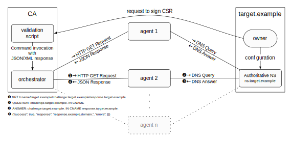

# Domain Validation++

## Introduction

The Domain Validation++ is a distributed domain ownership verification aiming
to prevent identity theft. This is done by comparing the result of multiple
servers on the internet which perform the validation. It consists of two parts:
the agents that perform the validation of a given domain and the orchestrator
that coordinates the validation by sending validation requests to all agents,
and verifying the results returned by the agents.

The agent and orchestrator implementation are written in Go. This does not only
ensure a good performance it also allows the easy compilation and cross compilation
of static executables. Static executables allow an easy deployment without the need
to install any runtimes or libraries. Only the shell script to generate certificates
requires OpenSSL or LibreSSL.

## Compilation

```bash
  go get github.com/dvpp/dvpp
  cd $GOPATH/src/github.com/dvpp/dvpp
  dep ensure
  go install 
```

## Overview



The orchestrator and the agents use HTTPS for their communication.  Currently,
only one cipher suite is allowed, `TLS_RSA_WITH_AES_256_GCM_SHA384`, which is
supported by all major browsers and command line tools like curl thus making
debugging easier.

Each agent has a self-signed certificate (can be generated with the included
shell script) which are bound to the IP address.  Also it's possible to use
domain names, but the use of domain names should be avoided. The orchestrator needs
to have a copy of every certificate from the vantage points it is using.  If
the certificate used in the HTTPS connection is unknown for the orchestrator
the connection will be canceled. The orchestrator does not include certificates
from other sources (e.g. the operating system).

## Validation

To perform a validation the orchestrator sends a GET requests like
`https://[user:pass@]ip:port/<methodname>/<parameter1>/.../<parametern>` to
each agent.  Authentication with username and password is optional but
strongly recommended.  Additionally, the agent can allow only certain IP
addresses or ranges.  If the orchestrator is accepted the agent will perform
the validation and return the result using a JSON object to the orchestrator.
The orchestrator will then compare the result of all responses.  The
orchestrator will tolerate a user defined number of failed validations and
choose the majority of the responses.  If the tolerance is set to zero, which
is the default, then all responses have to be valid for the validation to
succeed.

## Agents

The agent is a single executable and will try to load a configuration file upon
start. It will search for `./agent.yml`. If a configuration file is passed to the command line with the
`-f' option it will use this as its configuration file.

### Usage

```bash
NAME:
   domainvalidation agent - Run an agent that performs the validation of a domain requested by the orchestrator.

USAGE:
   domainvalidation agent [command options] [arguments...]

OPTIONS:
   --dns value, -d value    DNS servers
   --config FILE, -c FILE   Load configAgent file from FILE
   --logfile FILE, -l FILE  Load log file from FILE

```

The `-d` option will instruct the agent to use a supplied DNS server to
initiate the initial DNS request. If this option is not supplied the value from
/etc/resolv.conf will be used.  Multiple DNS servers need to be separated by a
comma.  The agent will select a random DNS server then upon start.  It is also
possible to supply or omit the DNS port like `domainvalidation agent -d 8.8.8.8,8.8.4.4:53`.
As mentioned before the `-f` is used to supply a configuration file.  With the
`-l` option the output is logged to a file.

### Configuration

```bash
Certificate: agent.crt
Key: agent.key
IP: 127.0.0.1
Port: 8268
Users:
    username: password
Whitelist:
    - 127.0.0.0/8
```

The `Certificate` and the `Key` fields define the certificate and its
corresponding key file.  The `IP` and `Port` fields define the IP and port the
agent binds to.  It is recommended to use random ports for each vantage point.
The `Users` section defines user credentials in the form of
`username:password`. This section can be omitted to disable authentication.
The `Whitelist` field defines allowed IP addresses or ranges in CIDR notation.
This section can also be omitted to allow all IP addresses.

## Orchestrator

Like the agent, the orchestrator is also single executable and will try to load
a configuration file upon start. It will search for `./orchestrator.yml`. If a 
configuration file is passed to the command linewith the `-f' option it will use 
this as its configuration file.

### Usage

```bash
NAME:
   dvpp orchestrator - Run the orchestrator that coordinates the validation by sending validation requests to all agents and verifying the result

USAGE:
   dvpp orchestrator [command options] cname <domain> <challenge> <response>

OPTIONS:
   --config FILE, -c FILE   Load configAgent file from FILE
   --logfile FILE, -l FILE  Load log file from FILE
   --verbose, -v            Verbose output
   --xml, -x                XML output
```

The `-f` is used to supply a configuration file.  With the `-l` option the
output is logged to a file.  `-v` toggles verbose output which can be helpful
for debugging.  If the `-x` switch is used the orchestrator will output XML
instead of JSON.

### Configuration

```bash
Timeout: 1000
Tolerance: 0
PoolSize: 0
Certificates: certs
Agents:
    Agent1:
        Host: 127.0.0.1
        Port: 8268
    Agent2:
        Host: 127.0.0.1
        User: username
        Pass: password
```

The `Timeout` field defines how long the orchestrator should wait for an agent
to respond.  This includes the connection time.  The `Tolerance` tells the
orchestrator how many invalid responses are tolerated.  Because timeouts count
as failed validations it is recommended to set this to a number greater than
zero if a sufficient number of agents is used.  The `PoolSize` defines how many
agents should be used. The orchestrator will randomly choose these agents for
every validation. If it is smaller than zero or greater than the number of
agents all agents are used.  `Certificates` defines the directory that contains
the certificates of all used agents.  Only the certificates are needed and not
the keys!

Finally, `Agents` defines the agents the orchestrator uses. Only the `Host`
field is needed. However, if a different port is used or the server uses
authentication (both is recommended) `Port`, `User` and `Pass` must also be
supplied.

### Output

```bash
$ dvpp orchestrator -c orchestrator.yml cname example.domain. challenge.example.domain. response.example.domain.
{
	"success": false,
	"response": "",
	"errors": [
		"agent2: received DNS response code 3",
		"agent1: received DNS response code 3"
	]
}

=== or with xml ===

$ dvpp orchestrator -x -c orchestrator.yml cname example.domain. challenge.example.domain. response.example.domain.
<result>
	<success>false</success>
	<response></response>
	<errors>
		<error>agent2: received DNS response code 3</error>
		<error>agent1: received DNS response code 3</error>
	</errors>
</result>
```

Depending on the success the orchestrator will exit with exit status 0
(success) or 1 (no success).  All occurred errors are listed for each agent.
In this example the tolerance was set to one.

## Methods

Currently, only the DNS DCV method (verifying a CNAME record) is supported.

### CNAME

The CNAME validation queries a given DNS server (e.g. 8.8.8.8) to receive the
authoritative server for a given domain.  It is recommended to set up a local
unbound server on each agent and use this as the DNS server.  The validation
will then send a supplied DNS CNAME query (challenge) to the authoritative
server and compare the response to the one that has been provided to the
server.  The challenges and responses must be chosen so that only the valid
domain owner can set those (like e.g. the md5 or sha1 sum of the CSR).

## Misc

In the `misc` directory example configuration for orchestrator and agents can
be found and a script to generate certificates.

### Certificate generation

A simple tool is provided to generate certificates for the vantage point
servers. The example `agent.cnf` can be edited to contain the wanted information.

```bash
[dn]
countryName = XX
stateOrProvinceName = SomeState
localityName = SomeCity
organizationalUnitName = My Company
commonName = My Company Agent 1

[alt_names]
IP.1 = 127.0.0.1

# don't edit below this line
[req]
prompt = no
req_extensions = v3_req
distinguished_name = dn

[v3_req]
basicConstraints = CA:FALSE
keyUsage = nonRepudiation, digitalSignature, keyEncipherment
subjectAltName = @alt_names
```

Only the entries in [dn] and [alt_names] have to be modified to match the
desired organization information and IP address. The file name of the
certificates will be based on the filename of the configuration file.  So for
`agent.cnf` the certificate will be `agent.crt` and the key will be
`agent.key`.  Simply invoke the `make_cert.sh` and supply the configuration
file:

```bash
> ./make_cert.sh agent.cnf
Generating RSA private key, 4096 bit long modulus
............................................................++
...........................................................................................++
e is 65537 (0x10001)
Signature ok
subject=/C=XX/ST=SomeState/L=SomeCity/OU=My Company/CN=My Company Agent 1
Getting Private key

> ls
make_cert.sh* agent.cnf       agent.crt       agent.key
```

## License

Domain Validation++

Copyright © 2018 Fraunhofer SIT

This program is free software; you can redistribute it and/or modify
it under the terms of the GNU General Public License as published by
the Free Software Foundation version 2.

This program is distributed in the hope that it will be useful,
but WITHOUT ANY WARRANTY; without even the implied warranty of
MERCHANTABILITY or FITNESS FOR A PARTICULAR PURPOSE. See the
GNU General Public License for more details.

You should have received a copy of the GNU General Public License
along with this program; if not, see <http://www.gnu.org/licenses/>.
